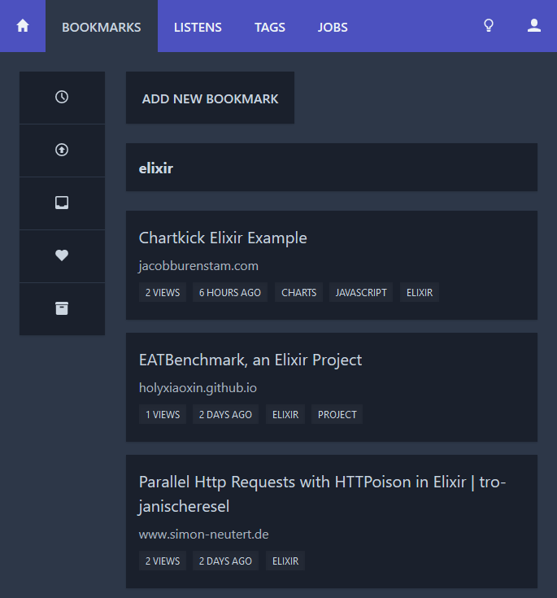

*can't resist*

# Tomie.Umbrella

## Development

Write your commit messages according to [Conventional Commits](https://www.conventionalcommits.org), use prefixes like:

* build
* chore
* ci
* docs
* feat
* fix
* improvement
* perf
* refactor
* style
* test

To deploy a release, use `mix git_opts.release`, then run `deploy.sh`.

## Screenshots

| Light Theme                         | Dark Theme                        |
| ----------------------------------- | --------------------------------- |
|      |      |

## Architecture

